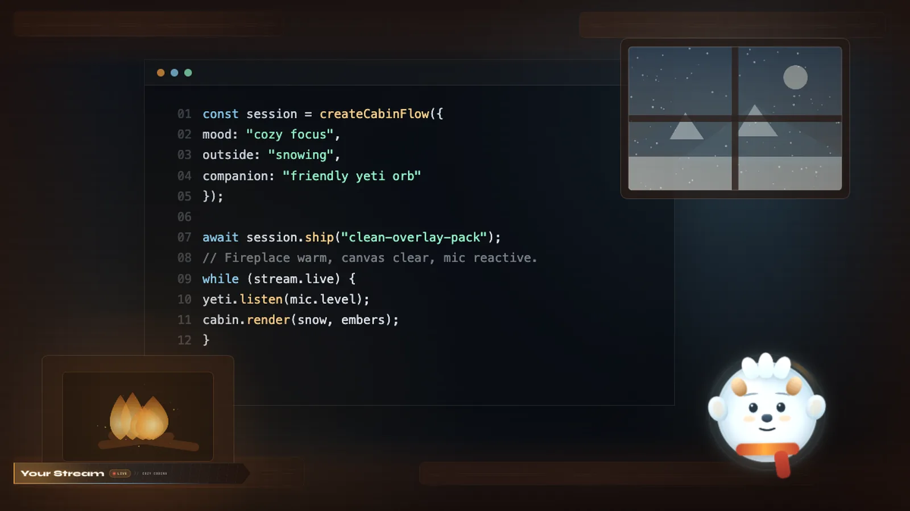
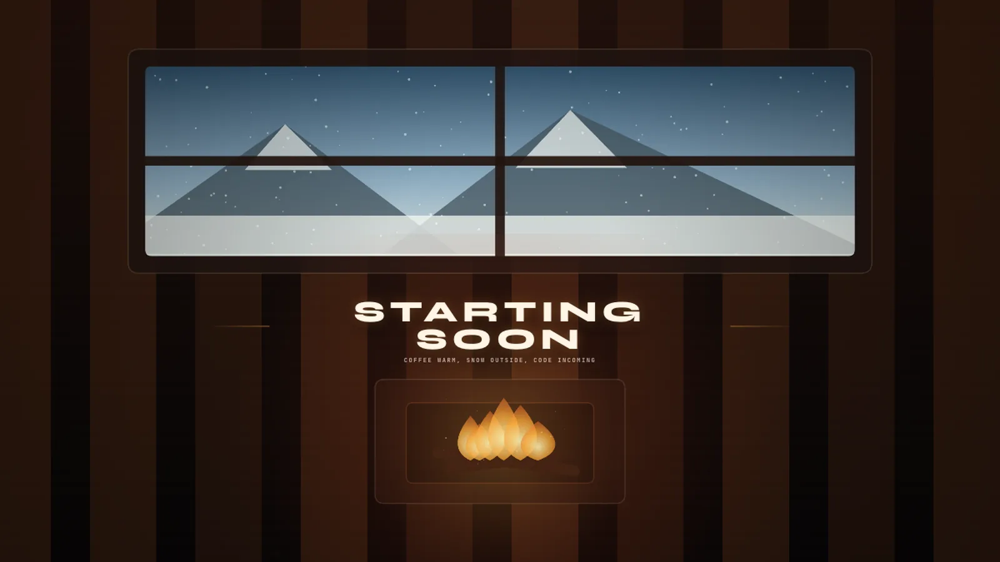
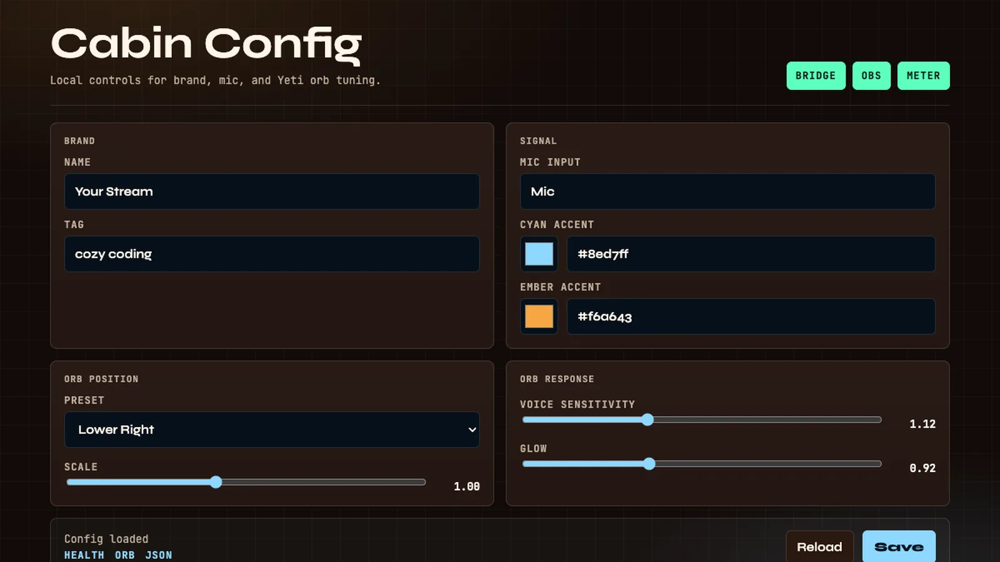

# TonkaToyXL OBS Templates

[](https://github.com/TonkaToyXL/obs-templates/actions/workflows/ci.yml)

Free OBS overlays and scene packs from [TonkaToyXL](https://github.com/TonkaToyXL) streams. No signup — download, unzip, double-click install.

**Share this link:** `https://github.com/TonkaToyXL/obs-templates`

## Download

| Template | What it is | Download | OBS |
|----------|------------|----------|-----|
<!-- DOWNLOADS:START -->
| **Cozy Cabin Yeti** | Warm snowy cabin coding scene with fireplace edge glow, snowfall, and a friendly mic-reactive Yeti orb. | [Download `cozy-cabin-yeti-v1.1.1.zip`](./dist/cozy-cabin-yeti-v1.1.1.zip) (307 KB) | 30.0 |
| **Nebula Vibe Desk** | Full-screen cosmic sky, shooting stars, moon, and voice-reactive holographic orb with local health and config panels. | [Download `nebula-vibe-desk-v2.2.1.zip`](./dist/nebula-vibe-desk-v2.2.1.zip) (281 KB) | 30.0 |
<!-- DOWNLOADS:END -->

## Preview

**Cozy Cabin Yeti v1.1.1**



| Starting Soon | Local config panel |
|---------------|--------------------|
|  |  |

**Nebula Vibe Desk v2.2.1**


| Starting Soon | Local config panel |
|---------------|--------------------|
|  |  |

Each zip is **plug-and-play**:

1. Download → unzip  
2. Double-click **`install.command`** (Mac) or **`Install.bat`** (Windows)  
3. OBS → **Scene Collection** → pick the installed template → **Vibe Coding**

## What's fixed vs customizable

| Included (core) | You customize |
|-----------------|---------------|
| Full scene collection with Vibe Coding + Starting Soon | Brand text, colors, and layout tuning |
| Voice-reactive orb/avatar | Local config page or `branding.user.json` |
| Local-only health/config bridge | Mic choice & audio filters in OBS |

## Requirements

- [OBS Studio](https://obsproject.com/) 30+
- Python 3. The installer creates a local bridge venv for `websockets`
- WebSocket enabled: OBS → **Settings** → **WebSocket**

## Develop / package

```bash
./scripts/sync-shared.sh
./scripts/build-scene.py
python3 scripts/build-cozy-cabin-yeti-scene.py
./scripts/generate-installers.sh
./scripts/validate.sh
./scripts/package.sh
```

Edit shared bridge/privacy files under `templates/_shared/` only — `sync-shared.sh` copies them into each template before package.

## License

MIT — use freely on your streams.

See [SECURITY.md](./SECURITY.md). Templates connect to OBS on your machine only (`127.0.0.1`).
